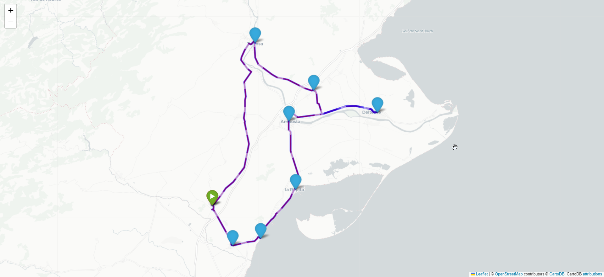
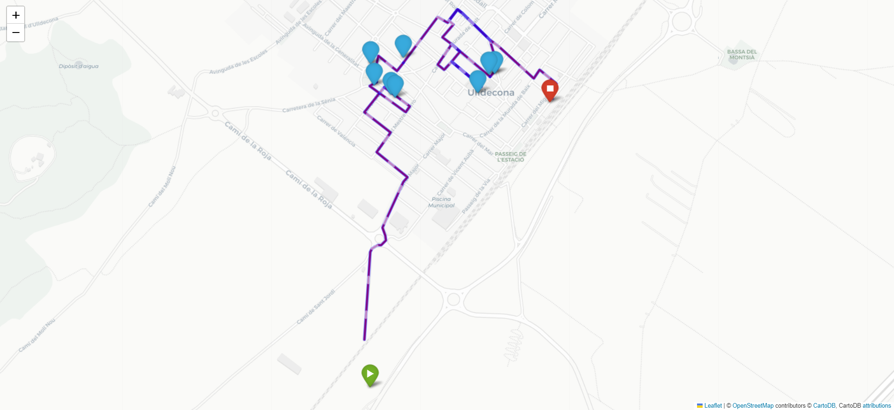

# Vehicle Routing Problem Solver with OpenStreetMap and OR-Tools

This repository demonstrates how to solve the Vehicle Routing Problem (VRP) using OpenStreetMap data and OR-Tools library. The VRP is a classic optimization problem where a set of vehicles is tasked with visiting a set of locations while minimizing the total distance traveled.

- [Vehicle Routing Problem Solver with OpenStreetMap and OR-Tools](#vehicle-routing-problem-solver-with-openstreetmap-and-or-tools)
  - [Approach of Two-Step Optimization](#approach-of-two-step-optimization)
  - [Requirements](#requirements)
  - [Installation](#installation)
  - [Notebook demo](#notebook-demo)
    - [Features](#features)
    - [Example Data](#example-data)
    - [Notebook structure](#notebook-structure)
  - [Output](#output)
    - [Optimal Route for Cities](#optimal-route-for-cities)
    - [Optimal Route for one city](#optimal-route-for-one-city)
  - [Future Improvements and Extensions](#future-improvements-and-extensions)
  - [Resources and References](#resources-and-references)


## Approach of Two-Step Optimization

The Vehicle Routing Problem (VRP) is a complex optimization problem that involves finding the most efficient routes for a set of vehicles to visit a given set of locations. To tackle this problem, the project uses a two-step optimization approach:

1. **Optimization Between Cities:**
    - In the first step, the script calculates the most optimal route for visiting all the cities from the input data.
    - It utilizes the OpenStreetMap Routing API to retrieve distance matrices between the centroids of each city, considering driving distance and road network information.
    - The obtained distance matrix is then used as input to the OR-Tools library to find the optimal route that minimizes the total distance traveled while visiting all the cities once.

2. **Optimization Within Cities:**
    - In the second step, the script selects the top 10 points of sales for each city based on their proximity to the city centroid.
    - It again utilizes the OpenStreetMap Routing API to retrieve distance matrices between the selected points of sales in each city.
    - These distance matrices are used as input to the OR-Tools library to find the optimal route for each city, starting and ending at the farthest point from the city centroid.
    - The objective is to minimize the total distance traveled while visiting the selected points of sales once in each city.

This two-step approach ensures an efficient and optimal solution to the Vehicle Routing Problem, considering both inter-city travel and intra-city point of sales visits. The results are visualized on interactive Folium maps for better understanding and analysis.

## Requirements
* Conda (Miniconda or Anaconda)
* Git (optional, if you want to clone the repository)
## Installation
Clone the repository (if you haven't already):
```bash
git clone <repository_url>
cd <repository_directory>
```
Create and activate the Conda environment using the env.yaml file:
```bash
conda env create -f env.yaml
conda activate travelling-salesman-routing
```

## Notebook demo

This repository provides a jupyter notebook with a step-by-step demonstration of how to solve the Vehicle Routing Problem (VRP) using OpenStreetMap data and OR-Tools library. The notebook showcases the functionality of the VRP solver implemented in the project.
### Features

- **API_OSMR**: Python module to interact with the OpenStreetMap Routing API and retrieve distance matrices between locations.
- **Routing**: Python module to optimize routes using OR-Tools library and plot the solutions on a Folium map.

### Example Data
Sample input data (```data/input/pos.csv```) contains latitude and longitude values of points of sales in different cities. The data is read from the CSV file and used to calculate optimal routes for this demo.

### Notebook structure

The notebook is divided into the following sections:

1. **Introduction to the Vehicle Routing Problem:**
    - An overview of the VRP and its importance in optimization and logistics.
    - Explanation of the two-step optimization approach for inter-city travel and intra-city point of sales visits.

2. **Data Loading and Preprocessing:**
    - Reading the sample input data (`data/input/pos.csv`) containing latitude and longitude values of points of sales in different cities.
    - Grouping the data to calculate city centroids and selecting top 10 points of sales for each city.

3. **Optimization Between Cities:**
    - Utilizing the OpenStreetMap Routing API to retrieve distance matrices between the city centroids.
    - Using OR-Tools to find the most optimal route for visiting all cities from the distance matrix.

4. **Optimization Within Cities:**
    - Utilizing the OpenStreetMap Routing API to retrieve distance matrices between selected points of sales in each city.
    - Using OR-Tools to find the most optimal route for visiting the selected points of sales in each city.

5. **Visualization of Optimal Routes:**
    - Plotting the optimal route for visiting all cities on an interactive Folium map.
    - Plotting the optimal route for visiting the selected points of sales in each city on individual Folium maps.

6. **Output and Analysis:**
    - Saving the best routes for each city in CSV files in the `data/output` folder.
    - Analyzing the results and discussing the efficiency of the two-step optimization approach.

## Output
The notebook will save the best route for each city in a CSV file located in the `data/output` folder. The CSV file will contain the names of the points of sales in the order they are visited along the optimal route. This provides a clear and organized representation of the sequence in which the points of sales should be visited to minimize the total distance traveled.
```csv
,name
0,Perpebrots_ulldecona
1,El Rebost
2,Bar lo negre
3,Cafetría-Bar Phoenix
4,Mont-Mar
5,El Mosset d'Exequiel
6,Kebab Ulldecona
7,Bar La Plaça
8,La Pollera
9,Lo Paseo
```
### Optimal Route for Cities
The CSV file is especially useful for practical implementations, as it allows businesses and logistics teams to plan their routes accordingly, ensuring efficient and cost-effective deliveries to the points of sales in each city.

The map image below showcases the optimal route for visiting all cities in the dataset. It illustrates the sequence of cities to be visited, starting from the chosen starting city and traversing through all other cities, returning to the starting point. Each city is represented by a marker, and the connecting lines indicate the optimized path between the cities.



### Optimal Route for one city

The map image below displays the optimal route for visiting the top 10 points of sales in the city of Ulldecona. It shows the most efficient path to visit the selected points of sales, starting from the farthest point from the city centroid and visiting all the points before returning to the starting point.


## Future Improvements and Extensions

The current implementation provides a solid foundation for solving the Traveling Salesman Problem and visualizing optimal routes for visiting cities and points of sales. However, there are several areas where the project can be expanded and improved to meet more complex real-world scenarios. Some potential future improvements include:

- **Time Windows for Visiting**: Incorporate time constraints for visiting points of sales, where each location has specific opening and closing times. This will ensure that the route adheres to the operational hours of the businesses.

- **Truck Loading and Capacity**: Extend the optimization to account for truck loading and capacity constraints. This enhancement will help in optimizing deliveries based on the available truck capacity and load distribution.

- **Total Time Restrictions**: Introduce total time restrictions for each route to limit the overall duration of deliveries for efficiency and time management.

- **Multiple Vehicles and Depots**: Expand the solution to handle multiple vehicles and depots, useful for scenarios with several delivery trucks starting from different locations.

- **Real-Time Traffic Data**: Integrate real-time traffic data to account for dynamic road conditions and further optimize route planning.

- **Alternative Algorithms**: Explore alternative algorithms and optimization techniques for solving the Traveling Salesman Problem, such as genetic algorithms, simulated annealing, or ant colony optimization.

- **Interactive User Interface**: Develop an interactive user interface that allows users to input their own datasets, visualize the optimized routes, and export the results.

By incorporating these improvements and extensions, the solution can be tailored to specific logistics and delivery scenarios, providing more accurate and practical route planning for businesses and organizations.

## Resources and References

This project utilizes several libraries and APIs to solve the Traveling Salesman Problem and visualize the optimal routes. Below are the links to the resources used:

- [Traveling Salesman Problem - Wikipedia](https://en.wikipedia.org/wiki/Travelling_salesman_problem): This Wikipedia page provides detailed information about the Traveling Salesman Problem, its variants, and various algorithms to solve it.

- [Open Source Routing Machine (OSRM) API](https://project-osrm.org/): OSRM is used to calculate driving distances and routes between cities and points of sales.

- [Google OR-Tools](https://developers.google.com/optimization/routing/tsp?hl=es-419): OR-Tools is an open-source library by Google for solving various optimization problems, including the Traveling Salesman Problem.

- [Folium Package](https://python-visualization.github.io/folium/): Folium is a Python library used for visualizing geospatial data on interactive maps. It is used to create interactive maps to display the optimal routes.

